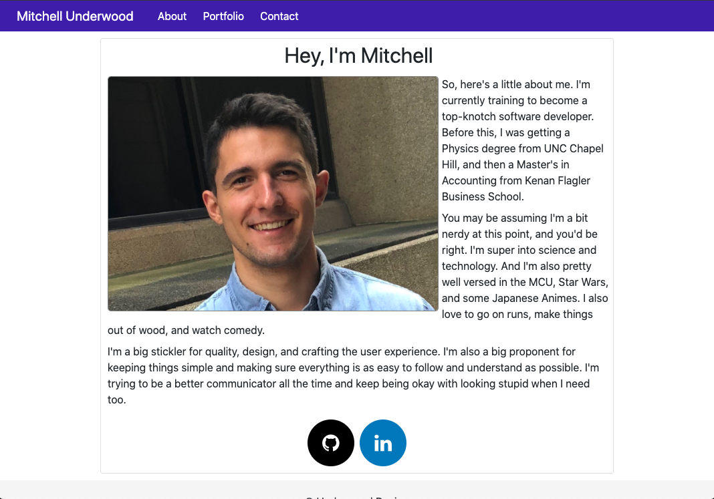
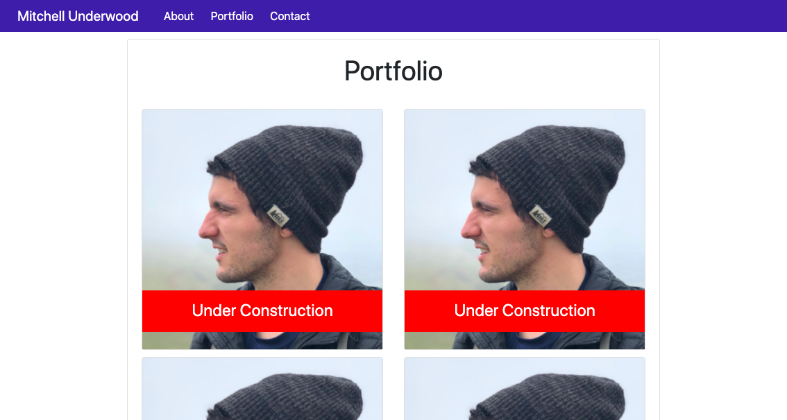
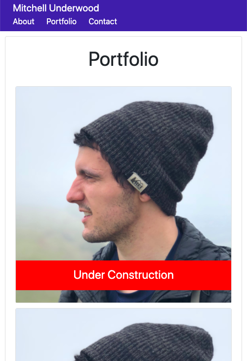

# Responsive Portfolio

## Description

> This simple, personal website is a good way to deploy a website to host professional information and projects for the enthusiastic, job-seeking programmer. Built to be responsive to multiply screen sizes, this site will look great on laptops, tablets, and smart phones. Out of the box, the site only has front-end capabilities, and is static as of right now. The site is composed of an "About Me", "Contact", and "Portfolio" pages. 

## Deployment

> This site can be deployed by using Github pages. I have not tried to host it using another hosting service.

## Features

> The site is built using simple HTML, CSS, and Bootstrap 4. Bootstrap's responsive grid allows the content to scale and reorganize to fit a range of screen sizes out of the box. Personally constructed css files can be used to further customize the default styling features. 

## Images

